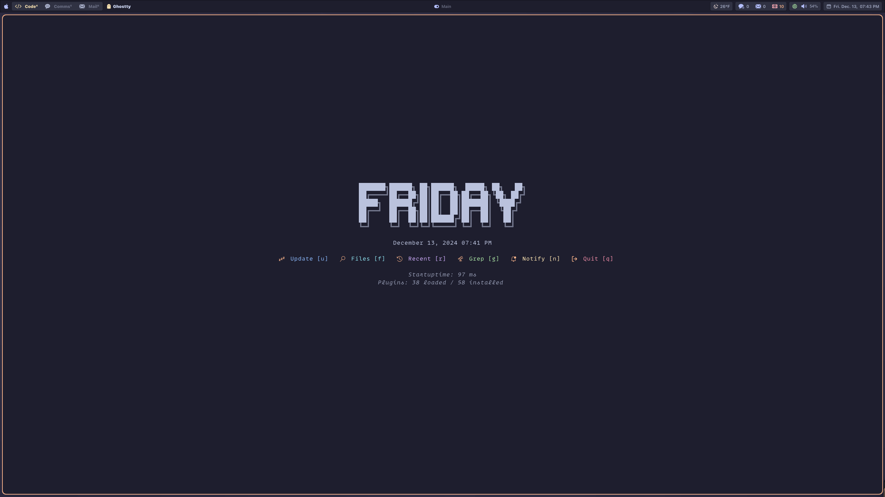
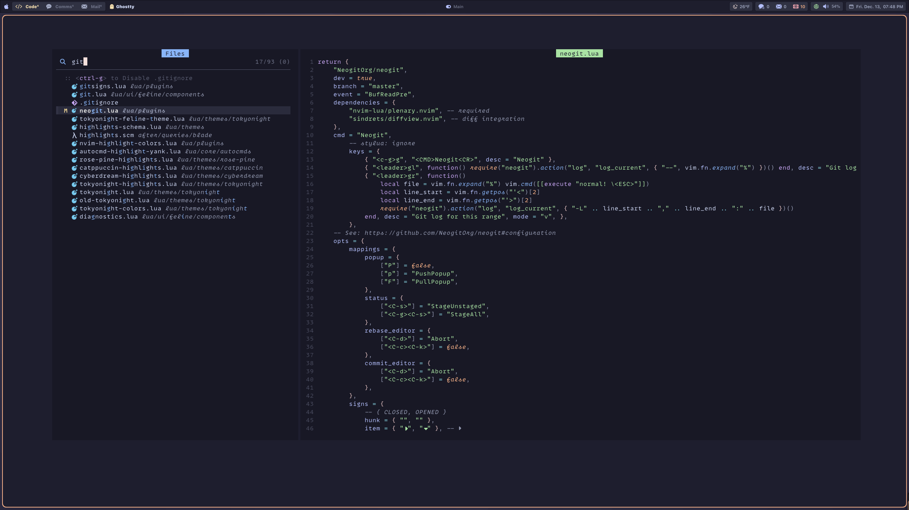
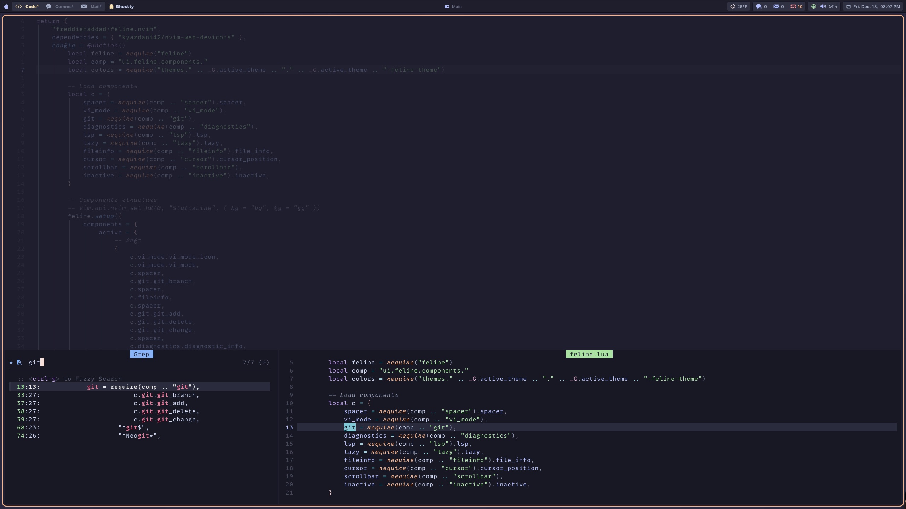

# nvim

Neovim Lab 🧪

Welcome to my Neovim setup, where code meets controlled chaos.

Huge thanks to all the dotfile wizards out there on GitHub—your configs and ideas brought this setup to life.
This Neovim setup is a bit of a Frankenstein’s monster, so feel free to explore, tweak, and use at your own risk!
It’s optimized for my workflow, but with a few adjustments, it might just fit yours too.

**Dashboard**
https://github.com/nvimdev/dashboard-nvim

**Fzf-lua**

**Feline**

**Fzf-lua; Fuzzy search**

